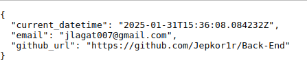

# Develop a Public API to Retrieve Basic Information

<em> Wait a minute! Before we dive in,what's an API?</em>

<stong> API (Application Programming Interface)</strong>

- It acts a bridge between different applications, allowing them to communicate with each other.
- A better analogy: Think of a restaurant. There’s a cook, a food server, and a guest. In this scenario, the <strong> API</strong> is the food server. It takes the guest's order (request), passes it to the cook (the backend logic), and then returns the cooked meal (response) to the guest.

<em>Okay. Lets dive in now!</em>

## About this Project
This is a simple Flask-based API that provides basic information: an email, current time in ISO 8601 formatted timestamp(must be dynamic), and a github link to the project's codebase.

- **Project Requirements:** What's needed for the success of thi project.
- **File Structure:** Shows the directory layout.
- **Running the Application:** Provides steps to start the Flask server and test the API.
- **Conclusion:** A brief wrap-up and instructions for extending the API.

## Project Requirements
- Programming Language/Framework:

- - I have used Python Framework, Flask.

- Deployment:

- - The API must be deployed to a publicly accessible endpoint. I used render.
- CORS Handling: 

- - This Flask application uses the `flask_cors` library to enable CORS for all routes `(/*)` and all origins `(*)`. This configuration allows other websites to interact with the API, even if they are hosted on different domains or ports.

- Response Format: All responses must be in JSON format.

- - Required JSON Response Format (200 OK),

# File Structure

flask_api/
│
├── venv             # Virtual environment directory
├── app.py           # Main Flask application file
└── README.md        # This README file

# Running the Application

To run the Flask application locally:

1. Set up a virtual environment (if not already set up):

- Create a virtual environment

`python3 -m venv venv`

- Activate the virtual environment

`source venv/bin/activate`       #linux

2. Install the required dependencies:

`pip install Flask flask_cors`

3. Run command:

`python3 app.py`

- This will start the Flask development server and your API is now running locally. Then, open your browser to make a GET request using the following URL:

`http://127.0.0.1:5000/api/info`

# Conclusions

This project demonstrates how to create a simple public API using Flask, enabling it to return dynamic data (current UTC time) and support cross-origin requests using CORS. You can extend this API by adding more endpoints, authentication, or other functionalities.
Feel free to explore skilled Python developers for your project <a href="https://hng.tech/hire/python-developers">here</a>.